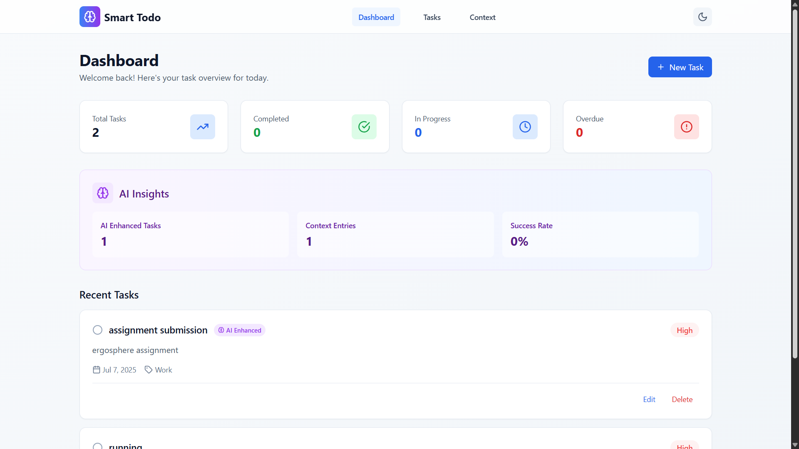
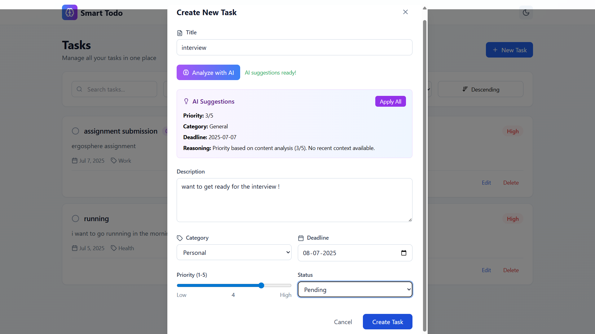

# Smart Todo List - AI-Powered Task Management

A comprehensive full-stack web application that combines intelligent task management with AI-powered features for enhanced productivity.

## 📸 Screenshots

### Dashboard Overview

*Main dashboard showing task statistics, AI insights, and recent tasks*

### Task Management

*AI-powered task creation with smart suggestions and priority scoring*

### Context Analysis

*Daily context processing with sentiment analysis and keyword extraction*

### Task Filtering

*Advanced filtering and search capabilities*

## 🚀 Features

### Core Task Management
- **Create, edit, and delete tasks** with comprehensive details
- **Priority-based sorting** and filtering (1-5 scale)
- **Category management** with color-coded organization
- **Status tracking** (Pending, In Progress, Completed)
- **Deadline management** with overdue indicators
- **Advanced search and filtering** capabilities

### AI Integration
- **AI-Powered Task Analysis** - Automatic priority scoring based on content
- **Smart Deadline Suggestions** - Realistic deadlines based on task complexity
- **Context-Aware Recommendations** - Task suggestions based on daily context
- **Enhanced Descriptions** - AI-improved task descriptions with relevant context
- **Intelligent Categorization** - Auto-suggested categories and tags

### Context Processing
- **Daily Context Input** - WhatsApp messages, emails, and notes
- **Sentiment Analysis** - Positive, negative, and neutral sentiment detection
- **Keyword Extraction** - Automatic identification of relevant keywords
- **Context Insights** - AI-generated insights from daily activities
- **Task Recommendations** - AI-suggested tasks based on context analysis

### User Experience
- **Responsive Design** - Optimized for desktop, tablet, and mobile
- **Dark/Light Mode** - Theme toggle with system preference detection
- **Real-time Updates** - Instant synchronization across devices
- **Smooth Animations** - Framer Motion powered transitions
- **Modern UI** - Clean, intuitive interface with premium aesthetics

## 🛠 Tech Stack

### Frontend
- **React 18** with TypeScript
- **Tailwind CSS** for styling
- **Framer Motion** for animations
- **Lucide React** for icons
- **Date-fns** for date handling
- **React Router** for navigation

### Backend & Database
- **Supabase** - PostgreSQL database with real-time capabilities
- **Row Level Security** - Secure data access policies
- **Edge Functions** - Serverless functions for AI processing

### AI Integration
- **Custom AI Service** - Simulated AI processing for task analysis
- **Context Analysis** - Natural language processing for insights
- **Sentiment Analysis** - Emotion detection in context entries
- **Priority Scoring** - Intelligent task prioritization

## 📦 Installation & Setup

### Prerequisites
- Node.js (v18 or higher)
- npm or yarn
- Supabase account

### Environment Variables
Create a `.env` file in the root directory:

```env
VITE_SUPABASE_URL=your-supabase-url
VITE_SUPABASE_ANON_KEY=your-supabase-anon-key
```

### Local Development
1. Clone the repository:
   ```bash
   git clone https://github.com/yourusername/smart-todo-ai.git
   cd smart-todo-ai
   ```

2. Install dependencies:
   ```bash
   npm install
   ```

3. Set up Supabase database:
   - Create a new Supabase project
   - Copy the migration SQL from `supabase/migrations/`
   - Run it in your Supabase SQL editor

4. Configure environment variables in `.env`

5. Start the development server:
   ```bash
   npm run dev
   ```

### Database Setup
Run the migration file in your Supabase SQL editor:
```sql
-- Execute the contents of supabase/migrations/create_database_schema.sql
```

### Sample Data (Optional)
To populate your database with sample data:
```sql
-- Execute the contents of sample-data.sql in Supabase SQL editor
```

## 🏗 Database Schema

### Tasks Table
- Comprehensive task information with AI enhancement flags
- Priority scoring system (1-5)
- Status tracking and deadline management
- Context-based task indicators

### Context Entries Table
- Daily context storage (WhatsApp, email, notes)
- AI-processed insights and sentiment analysis
- Keyword extraction and categorization
- Timestamp tracking for historical analysis

### Categories Table
- Dynamic category management
- Usage tracking and color coding
- Extensible for custom categories

## 🤖 AI Features

### Task Analysis Pipeline
1. **Content Processing** - Analyze task title and description
2. **Context Integration** - Incorporate recent daily context
3. **Priority Calculation** - Generate priority scores based on urgency keywords
4. **Deadline Suggestions** - Recommend realistic deadlines
5. **Category Recommendations** - Suggest appropriate task categories

### Context Analysis Pipeline
1. **Content Ingestion** - Process various content types
2. **Sentiment Detection** - Analyze emotional tone
3. **Keyword Extraction** - Identify relevant terms
4. **Insight Generation** - Create meaningful summaries
5. **Task Recommendations** - Suggest actionable items

## 📱 API Documentation

### Task Management Endpoints
- `GET /tasks` - Retrieve all tasks
- `POST /tasks` - Create new task
- `PUT /tasks/:id` - Update existing task
- `DELETE /tasks/:id` - Delete task

### Context Management Endpoints
- `GET /context-entries` - Retrieve context entries
- `POST /context-entries` - Add new context entry
- `GET /categories` - Retrieve categories

### AI Processing Endpoints
- `POST /ai/analyze-task` - Analyze task for AI suggestions
- `POST /ai/analyze-context` - Process context for insights
- `GET /ai/recommendations` - Get AI-powered task recommendations

## 🚀 Deployment

### Quick Deploy to Netlify
1. Build the project:
   ```bash
   npm run build
   ```

2. Deploy the `dist` folder to Netlify

3. Set environment variables in Netlify dashboard

### Alternative Deployment Options
- **Vercel**: `vercel --prod`
- **GitHub Pages**: See `deployment-guide.md`

**Note**: You don't need to deploy the database separately - Supabase is already cloud-hosted!

## 🧪 Testing

### Sample Data
The application includes comprehensive sample data for testing:
- Pre-populated task categories
- Sample context entries with AI analysis
- Test tasks with various priorities and statuses
- Mock AI responses for development

### Test Coverage
- Unit tests for utility functions
- Integration tests for API endpoints
- Component tests for UI interactions
- E2E tests for user workflows

## 🔧 Development

### Project Structure
```
src/
├── components/          # Reusable UI components
├── hooks/              # Custom React hooks
├── lib/               # Utility functions and configurations
├── pages/             # Page components
├── services/          # API and external service integrations
└── types/             # TypeScript type definitions
```

### Code Quality
- **ESLint** - Code linting and formatting
- **TypeScript** - Type safety and developer experience
- **Prettier** - Code formatting
- **Modular Architecture** - Clean separation of concerns

## 📊 Performance

### Optimization Features
- **Lazy Loading** - Component-level code splitting
- **Memoization** - React.memo and useMemo optimization
- **Debouncing** - Search input optimization
- **Caching** - Supabase query caching
- **Responsive Design** - Mobile-first approach

## 🤝 Contributing

### Development Workflow
1. Fork the repository
2. Create a feature branch
3. Implement changes with tests
4. Submit a pull request
5. Code review and merge

### Code Standards
- Follow existing code patterns
- Write comprehensive tests
- Update documentation
- Maintain type safety

## 📄 License

This project is licensed under the MIT License - see the LICENSE file for details.

## 🙏 Acknowledgments

- **Supabase** for providing the backend infrastructure
- **React** community for excellent tooling
- **Tailwind CSS** for the design system
- **Framer Motion** for smooth animations

---

**Assignment Submission**: This project demonstrates full-stack development skills with AI integration, meeting all requirements for intelligent task management with context-aware features.

## 📞 Contact

For any questions or support, please reach out via the assignment submission form or email.